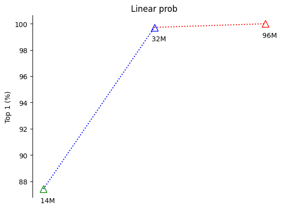
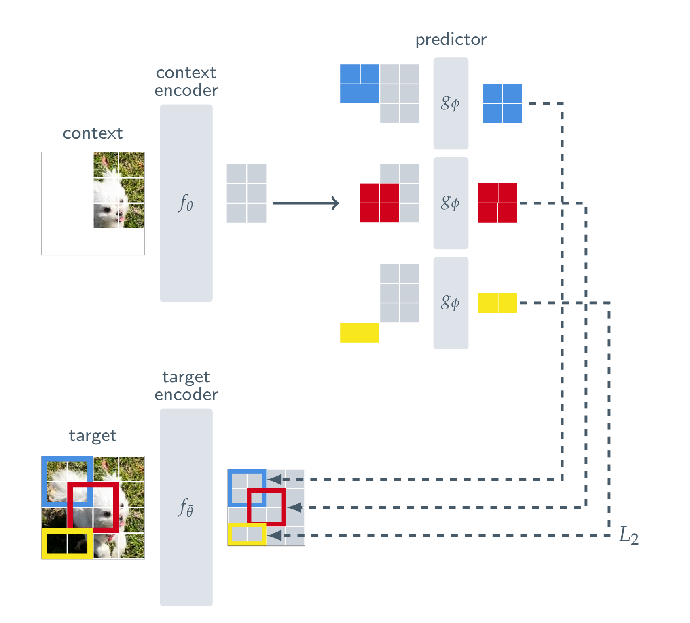
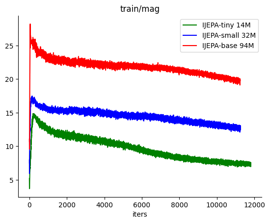
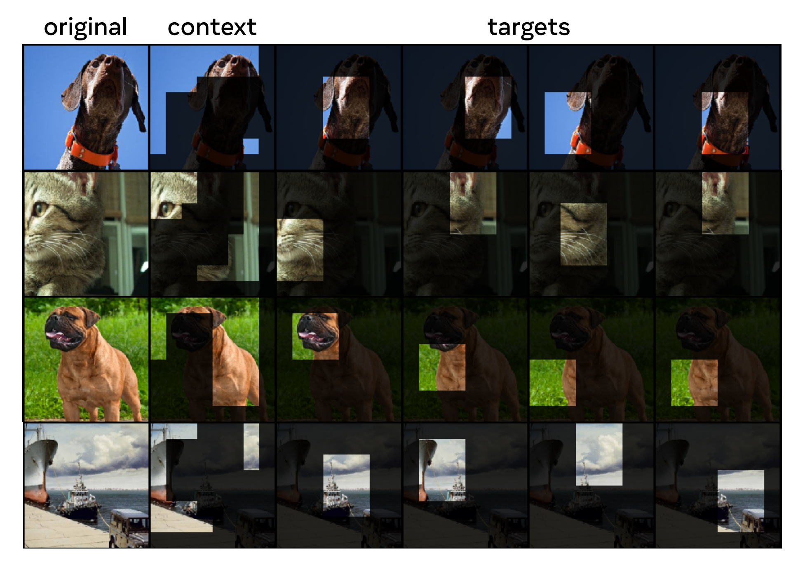
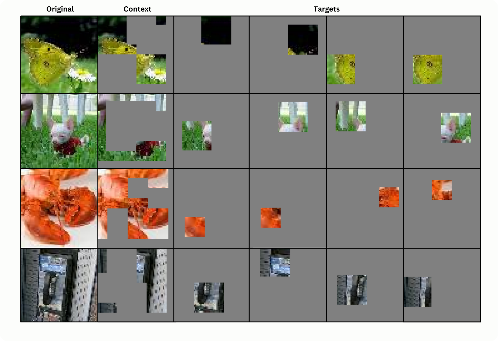
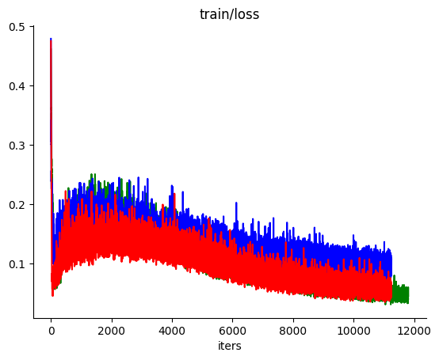

# tiny-IJEPA

This is a repository to train a tiny I-JEPA on tiny imagenet :). Currently ```train.py``` train an IJEPA with Vit-tiny (~14M) on tiny imagenet with 87% top 1 accuracy on with linear probing. The code is simple and hackable: ```model.py``` is ~ 250 lines and ```train.py``` ~ 250 lines. You can easily scale up the model or train with larger image dataset (official IJEPA was trained on Imagenet 1k), though you will need a GPU cluster and wrap ```train.py``` in DDP. Took take ~ 2 hours to train tiny-IJEPA  on GeForce RTX 4050 8GB. 



# dependency
```
pip install torch datasets numpy
```

that's it!

# quick start

Okay, first we download [tiny-imagenet](https://huggingface.co/datasets/zh-plus/tiny-imagenet) from huggingface, normalise, and remove grey scale images to ensure consistency. Run

```
python data/tiny_imagenet/prepare.py
```
This will produce 4 files: ```train_img.bin```, ```valid_img.bin```, ```train_label.bin```, and ```val_label.bin```. 

Now let's train!

```
python train.py configs/train_ijepatiny_tinyimagenet.yml
```
Here we train IJEPA-tiny which patches `3x64x64` image into `3x8x8` with embedding dimension of 256. Context and target encoder has 12 layers with 4 heads and predictor has 6 layers with 4 heads. After ~2 hours on a laptop GPU you should have a good pretrained IJEPA. Now, to see how well it performs on classification task, run:
```
python train.py configs/train_ijepatiny_tinyimagenet.yml --overrides init_from='resume' lnrpobe_only=True lnprobe_split='train' 
```
This will training a single linear layer to take output patch embedding from IJEPA target encoder and classify to labels on entire tiny imagenet. We should see ~ 87% top 1 accuracy. Other default configs include `Vit-small 32M` and `Vit-base 94M`.
# intro to IJEPA

[I-JEPA](https://arxiv.org/abs/2301.08243) is a self-supervised learning approach for images. The idea is simple: given an image with some part masked out (context block), predict the masked out portion (target block). By doing this well, the model will have good semantic understanding of images. The key point here is that prediction is done in latent space, not pixel space. I like to think about this latent prediction as a way to excluded some unnecessary fine-grained noise and focus on the overall semantic content. This is trivial as models that tries to predict pixels such as [Masked Autoencoders](https://arxiv.org/abs/2111.06377) have to allocated substantial amount of its capacity to learning fine-grained details



Okay great, latent prediction helps the model to learn overall semantic content, but how do we know what the latent representation should be? I-JEPA uses the output of the target encoder as "ground truth" for the context encoder to learn what the latent representation should be. The context encoder is trained through gradient descent while the target encoder's weights are updated using the Exponential Moving Average (EMA) of the context encoder's weights. 

**Note** that if target encoder is also trained using gradient descent, the model will collapse aka latent representation will converge to 0. We can track if the model is collapsing during training by watching the norm of target block prediction.



The Exponential Moving Average (EMA) update for the target encoder's weights can be formulated as follows:

$$ \theta_{\text{target}} \leftarrow \lambda \theta_{\text{target}} + (1 - \lambda) \theta_{\text{context}} $$

where:
- $\theta_{\text{target}}$ are the weights of the target encoder,
- $\theta_{\text{context}}$ are the weights of the context encoder,
- $\lambda$ is the momentum, a hyperparameter typically close to 1 (e.g., 0.9).

This formula ensures that the target encoder's weights are a smooth, slowly changing average of the context encoder's weights. Think of target encoder as a "dumbed down" version of the "smart" context encoder, these 2 encoders coevolve during training. EMA also act as an regularisation method mitigate representation collapse. Though it is a bit weird to think that the "dumb" encoder is teaching the "smart" encoder :). 

# how to get context and target block
According to the paper, we randomly extract 4 target blocks from every patched image. Each block's aspect ratio are chosen randomly from range (0.75,1.5), and scale from range (0.15, 0.2). Context block are also randomly sampled with a random scale in range (0.85, 1.0) from the original patched image, then any overlapping patches with all target blocks are removed. Not a big fan of these hardcoded number, although the paper did experiment with other hyperparameters and these seems to work best. 

 

You can try playing with `img_visual.ipynb` to see how the images are being masked in tiny-IJEPA. Here are some samples



# training 
Let's talk forwarding I-JEPA. 

Initialise context encoder, predictor. Target encoder is a copy of context encoder (same weights, same architecture)

Context blocks or patches are fed into the context encoder to obtain context representation, call these context tokens for simplicity. Learnable tokens tiled with positional embedding of target tokens are then concatenated to context tokens and fed into the predictor. We will only use the predicted target tokens to compute loss.

The target encoder will receive **all patches** of the image. After forwarding, select the specified target tokens to compute loss. No gradients will be computed for target encoder

The paper use L2 loss however the official I-JEPA implementation uses ```smooth_L1_loss```. 

Backpropagate predictor, context encoder then update target encoder using EMA. Thats it!


# linear probing

We can't directly evaluate I-JEPA performance using the training loss as it is not an objective metric. Kinda looks like this...


To evaluate, we follow the linear protocol of training a **single** linear layer on top of the frozen **target encoder** for classification task. The paper propose 2 input types for linear probing.
- average-pooled patches embedding from last layer of target encoder.
- concatenation of average-pooled patches embedding from last 4 target encoder layers

Seems like option 2 works better however that just might be because there are more parameters...

# todo
- build decoder to visualise learned latent representation? 
- tune hyperparam
- try different scale and aspect ratio

# reference
- [Official I-JEPA paper](https://arxiv.org/abs/2301.08243): a highly recommend read
- [Official implementation of I-JEPA](https://github.com/facebookresearch/ijepa): for more advanced implementation
- [nanoGPT](https://github.com/karpathy/nanoGPT): main inspiration behind this project. Thank you Andrej for the amazing repo and videos!


